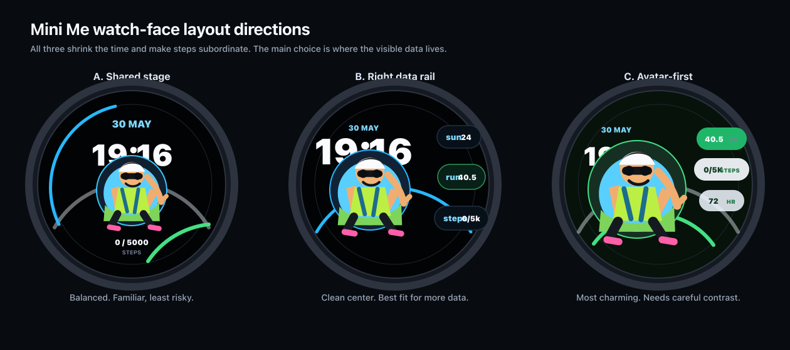

# Garmin Mini Me

Garmin Mini Me is a Garmin Connect IQ watch-face prototype built around **Mini Ido**, a tiny companion that reflects the wearer's activity, recovery, and daily rhythm directly on the watch face.

The project is intentionally mood-first: data such as steps, weekly running distance, weather, time of day, and future recovery/workout signals are translated into a friendly glanceable presence instead of a dense dashboard.



## Project Status

This repository currently contains a working Connect IQ watch-face prototype for the Garmin Forerunner 570 47mm target. The active app uses compact 454x454 palette-reduced backgrounds, right-side metric rows, large digital time, and a once-per-day step-goal celebration treatment.

The current prototype focuses on proving the layout, asset pipeline, and behavior model before expanding into richer Garmin data integrations such as recorded workouts, recovery signals, and sleep quality.

## Core Experience

- **Mini Ido companion**: a small watch-face avatar that reacts warmly to the user's day.
- **Mood-first display**: the watch face chooses a visible mood such as proud, sleepy, soft, or neutral rather than exposing a raw score.
- **Gentle nudges**: celebration moments are positive and low-pressure, avoiding strict training demands or virtual-pet maintenance loops.
- **AMOLED-friendly layout**: a dark, glanceable digital watch-face composition with peripheral metrics kept compact.
- **Celebration windows**: step-goal celebration is implemented as a temporary proud state with a support sign.

## Current Watch-Face Features

- Large digital time.
- Date formatted as `DD/MM`.
- Current steps from `ActivityMonitor.getInfo().steps`.
- Daily step-goal celebration using Garmin activity info and persistent storage.
- Weekly running distance display, preferring recorded running history when available and falling back to activity-monitor distance.
- Current weather temperature display when available.
- Right data rail with steps, weekly running distance, and weather icons.
- Mood-specific 454x454 background artwork.
- Startup fast-paint path and partial update optimization for better watch-face responsiveness.

## Repository Layout

```text
.
├── WatchFace/                 # Active Garmin Connect IQ watch-face app
│   ├── source/                # Monkey C application and watch-face view
│   ├── resources/             # Active strings, drawables, icons, and backgrounds
│   ├── unused_drawables_archive/
│   ├── manifest.xml           # Connect IQ app metadata and target product
│   └── monkey.jungle          # Connect IQ build configuration
├── archived-assets/           # Large or inactive reference assets kept out of the app bundle
├── mockups/                   # HTML, SVG, and PNG layout/design explorations
├── device-binary/             # Expected output location for device builds
├── CONTEXT.md                 # Product language and concept decisions
└── NEXT_STEPS.md              # Implementation checklist and feasibility notes
```

## Target Device

The current build target is:

- **Garmin Forerunner 570 47mm**: `fr57047mm`, 454 x 454 round AMOLED, Connect IQ API level 6.0.

The app manifest also documents the current watch-face application metadata and permissions under `WatchFace/manifest.xml`.

## Build Requirements

Install the Garmin Connect IQ SDK and make sure `monkeyc` is available on `PATH`.

Set your Garmin developer key path locally with the `GARMIN_DEVELOPER_KEY` environment variable. Do not commit personal key paths to the repository.

```sh
export GARMIN_DEVELOPER_KEY="/path/to/local/developer_key"
```

Build the device artifact from the `WatchFace/` directory:

```sh
cd WatchFace
monkeyc -f monkey.jungle -d fr57047mm -o ../device-binary/WatchFace.prg -y "$GARMIN_DEVELOPER_KEY"
```

## Design Notes

- Keep active watch-face resources in `WatchFace/resources`.
- Keep large or inactive images in `archived-assets/` so they do not inflate the app bundle.
- Do not restore archived 580x580 backgrounds into active resources; the active backgrounds are intentionally 454x454 palette-reduced PNGs.
- Treat Mini Ido as a companion, not a pet, mascot, or strict coach.
- Keep v1 positive and non-judgmental, with celebration messages reserved for meaningful reward moments.

## Roadmap

Near-term work is tracked in `NEXT_STEPS.md`. Major upcoming areas include:

- Confirming Garmin watch-face access to recorded workout details.
- Implementing workout celebration after the first recorded workout of a day.
- Evaluating available recovery and sleep-quality signals.
- Replacing placeholder/prototype visual states with finalized Mini Ido assets.
- Testing readability and battery-conscious update behavior on target hardware or simulator.

## Key Project Documents

- [`CONTEXT.md`](CONTEXT.md): product language, behavior model, and concept guardrails.
- [`NEXT_STEPS.md`](NEXT_STEPS.md): completed decisions, implementation checklist, and feasibility checks.
- [`WatchFace/README.md`](WatchFace/README.md): app-level watch-face notes and target-device summary.
- [`archived-assets/`](archived-assets/): archived artwork and reference images.
- [`mockups/`](mockups/): visual layout explorations and concept previews.
